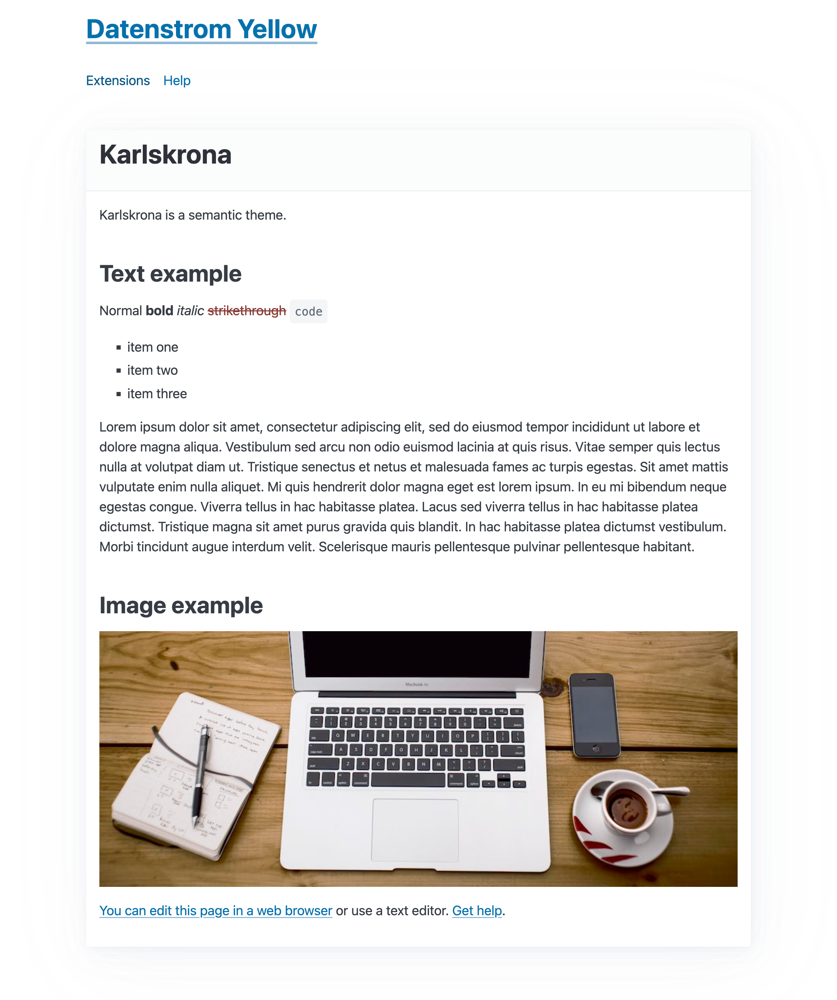

# Karlskrona 0.8.19

Karlskrona is a semantic theme.

## How to install an extension

[Download ZIP file](https://github.com/pftnhr/yellow-karlskrona/archive/refs/heads/main.zip) and copy it into your `system/extensions` folder. [Learn more about extensions](https://github.com/annaesvensson/yellow-update).

## How to customise a theme

All theme files are stored in your `system/themes` folder. All layout files are stored in your `system/layouts` folder. You can edit these files. Your changes will not be overwritten when the website is updated.

The default theme is defined in file `system/extensions/yellow-system.ini`. A different theme can be defined in the [page settings](https://github.com/annaesvensson/yellow-core#settings-page) at the top of each page, for example `Theme: karlskrona`. [Learn more about themes](https://datenstrom.se/yellow/help/how-to-customise-a-theme).

## Acknowledgements

This extension now includes [Pico CSS v2.0.3](https://github.com/picocss) a minimal CSS Framework for semantic HTML. Elegant styles for all native HTML elements without `.classes` and dark mode automatically enabled. Many thanks to [Lucas Larroche](https://github.com/lucaslarroche) for this beautiful and versatile framework.

## Designer

Robert Pfotenhauer. [Get help](https://datenstrom.se/yellow/help/).
